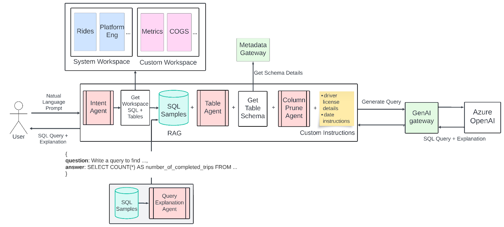
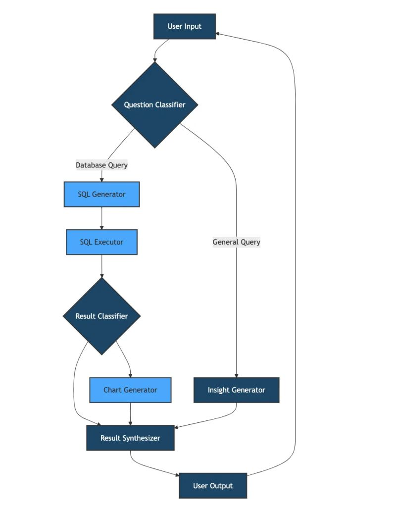
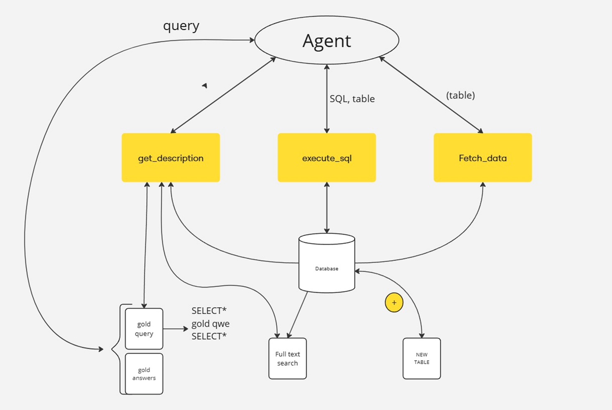
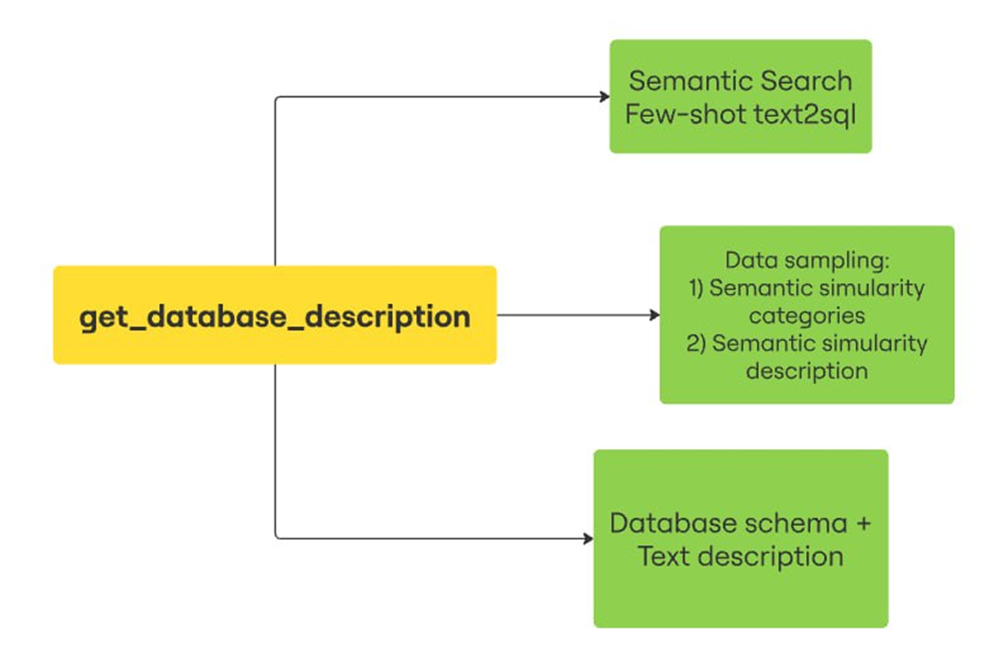
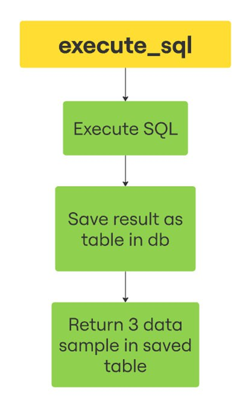

# Создание финансового ассистента

## Задача

Создать финансового ассистента на основе LLM. 
Ассистент должен уметь отвечать на вопросы о финансах пользователя и решать его задачи, связанные с деньгами и бюджетом.

## Дано
- Пользовательские запросы: вопросы и ответы
- Таблицы с транзакциями пользователя
- Доступ к LLM

## Пример - эталон ассистента

## По задаче необходимо
- Собрать пайплайн который сможет на эти вопросы отвечать
- Основная сложность, что промптингом с text2sql моделью норм на эти
вопросы не ответить
- Нужно строить лэйер с ретривалом таблицы прежде чем подавать в LLM
(RAG)
- Можно попытаться решить промптингтом, можно РАГом, можно СФТ и
разные результаты получить
- (!) Главное - придумать как оценить качество решения

## Общий Work flow

##

## Наша архитектура

### Text2sql tools

