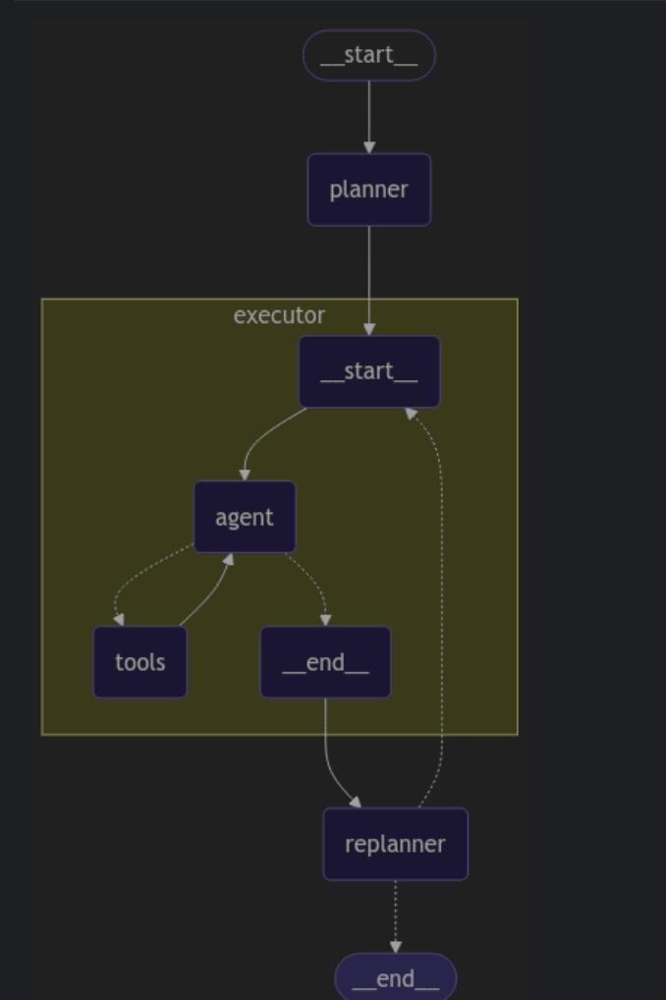

# SiriusFinAssist

## Дано
- Пользовательские запросы
- Таблицы с транзакциями
- Доступы к каким-то LLM

## Пример

## Надо
- Собрать пайплайн который сможет на эти вопросы отвечать
- Основная сложность, что промптингом с text2sql моделью норм на эти
вопросы не ответить
- Нужно строить лэйер с ретривалом таблицы прежде чем подавать в LLM
(RAG)
- Можно попытаться решить промптингтом, можно РАГом, можно СФТ и
разные результаты получить
- (!) Главное - придумать как оценить качество решения

## Work flow

##

## Наша архитиктура

## Архитектура базового решения

